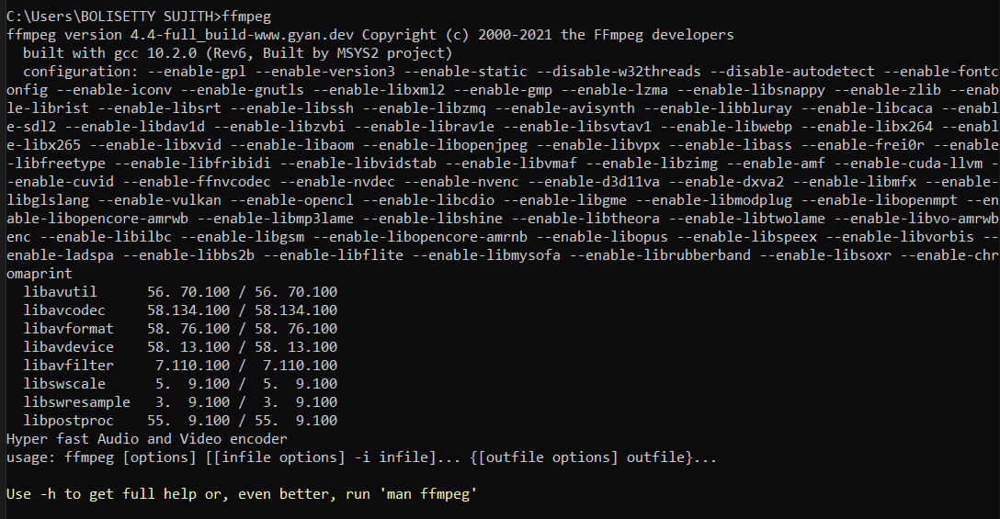

# **Screen Recorder**

It a screen recorder program which will record both your ***voice*** and ***Screen***.

### Built with: Python

## **Installation**
- First ***fork*** 🍴 this repository and ***clone*** this repository into your local system

    ```git clone https://github.com/<your-github-username>/ScreenRecorder.git```
- Install the required modeules using a single command

    ```pip install -r requirements.txt```
- Run the python file

    ```python ScreenRecorder.py```
- Watch the recorded video in the path declared for storing the video. 
### **Possible Errors**
#### PyAudio errors
- For PyAudio errors in **windows**, please refere stackoverflow solution [here](https://stackoverflow.com/questions/52283840/i-cant-install-pyaudio-on-windows-how-to-solve-error-microsoft-visual-c-14)
- For PyAudio installation errors in **linux**. You need to follow the below instructions:

    ```sudo apt-get install portaudio19-dev python-pyaudio```

    ```pip install PyAudio```

Most probably the errors will be resolved
- That's it run the program in the ***cmd*** the screen rocording will be started.
- To stop the recording *press the '**q**' key to stop the recording*
#### ffmpeg errors
If you get any errors😞 regarding **ffmpeg** follow the instructions :

- From [here](https://www.videohelp.com/software/ffmpeg) Download the **ffmpeg** save it in any folder you want.
-  Press ```windows+R``` to open ```RUN``` enter ```SystemPropertiesAdvanced.exe``` and press enter.
- Click on the ```EnvironmentVariables``` it will open a window
- In the window under ```user variable``` click on the ```Path``` and click the ```Edit``` button, a window called Edit environment variable will be displayed.
- Click the new button and enter the ```bin``` directory path in downloaded  ```ffmpeg``` directory
    
    Eg: ```C:\Users\BOLISETTY SUJITH\Downloads\ffmpeg\bin``` => ```DOWNLOADED-PATH-TO-ffmpeg-DIR\ffmpeg\bin```

- That's it again verify whether it by clicking ```ffmpeg``` in your ```cmd```
### Output for successful working of ffmpeg🙂

[](FinalOutput.png)

After solving the errors RUN the code ```python ScreenReocrder.py``` it will successfully start screen recording and it will save the final Screen Recording file into your declared path.

If you like and think this is useful repository start using this Screen Recorder.
